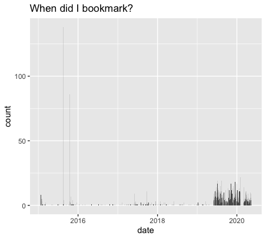

<!-- README.md is generated from README.Rmd. Please edit that file -->

```{r, include = FALSE}
knitr::opts_chunk$set(
  collapse = TRUE,
  comment = "#>",
  fig.path = "man/figures/README-",
  out.width = "100%"
)
```

# pinboardr

<!-- badges: start -->
[](https://CRAN.R-project.org/package=pinboardr)
[](https://choosealicense.com/licenses/mit/)
[](https://www.tidyverse.org/lifecycle/#maturing)
[](https://www.repostatus.org/#active)
[](https://travis-ci.org/RMHogervorst/pinboardr)
<!-- badges: end -->

The goal of pinboardr is to interact with the [pinboard.in](https://pinboard.in) website. You can use this package
to add new bookmarks, delete them, extract all bookmarks, or to add, modify or remove tags.
Basically everything you can do through the website, but from an R session.
This is a full implementation of all the endpoints in <https://pinboard.in/api>.

All user facing functions start with `pb_*` , making it easy to use.


> Pinboard is a personal archive for things you find online and don't want to forget.
> The site has been around since July 2009 and has about 25,000 active users.

If you don't know what pinboard is, this is not a package for you. 
If you would like to know more about pinboard, take [the tour](https://pinboard.in/tour/).

## Installation

You can install the released version of pinboardr from [CRAN](https://CRAN.R-project.org) with:

``` r
# install.packages("pinboardr") # not yet
```

And the development version from [GitHub](https://github.com/) with:

``` r
# install.packages("devtools")
devtools::install_github("RMHogervorst/pinboardr")
```

## Credentials
This is a package to interact with '<https://pinboard.in>, a payed (not free) bookmarking website.
To use this package you need to use your username and token from pinboard.
See also `?authentication` for more details.

Go to the [pinboard password page](https://pinboard.in/settings/password) and scroll down to API Token. It says something like: "this is your API token: username:NUMBERSANDLETTERS
My recommendation would be to add this token and username to your local or global .Renvironment file
(use for example `usethis::edit_r_environ()` to find that file on your computer).

```
PB_USERNAME=username 
PB_TOKEN="NUMBERSANDLETTERS"
```

Restart your session to make the changes active.

## Examples
This part shows you some of the functions implemented in this package.

```{r example}
library(pinboardr)
```


When was my last update on pinboard?
```{r}
pb_last_update()
```

Get your most recent bookmarks (of a certain tag, or globally)
```{r}
recent <- pb_posts_recent(tags = "inspiration",count = 3)
recent[,c("title", "toread","tags")]
```

When did I bookmark all my bookmarks?

```{r, eval=FALSE}
library(ggplot2) 
library(dplyr)
per_date <- pb_posts_dates()

per_date %>% 
  mutate(date = as.POSIXct(date)) %>% 
  ggplot(aes(date, count)) + 
  geom_col()+
  labs(title="When did I bookmark?")
```



Did I read all my bookmarks with the tag inspiration?
```{r}
all <- pb_posts_all(tags = "inspiration", todt="2020-01-01")
table(all$toread)
```
Most common tags with inspiration

```{r}
huge_vec <- unlist(strsplit(all$tags, split=" "))
# note that this is way more intuitive with dplyr
# data.frame(vec=huge_vec) %>% group_by(vec) %>% count() %>% arrange(desc(n))
counted <- as.data.frame(table(huge_vec))
top <- counted[counted$Freq >1,]
top[order(top$Freq,decreasing = TRUE),]
```

Can we extract all of the bookmarks with the blogidea tag?

```{r}
all_blogidea <- pb_add_tag_column(all, "blogidea")
all_blogidea[all_blogidea$blogidea,c("href","title")]
```

Get all tags used
```{r}
all_tags <- pb_tags_get() # will show all 583 tags I have used
head(all_tags, 4)
```


Please note that the "pinboardr" project is released with a
[Contributor Code of Conduct](CODE_OF_CONDUCT.md).
By contributing to this project, you agree to abide by its terms.
